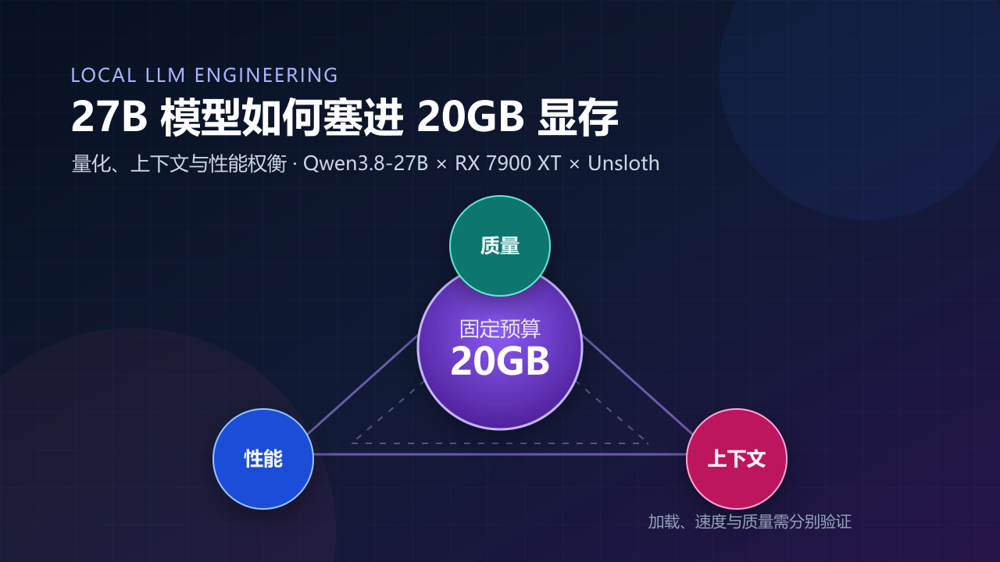
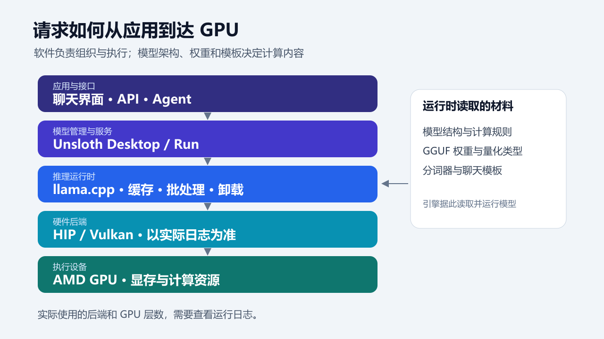
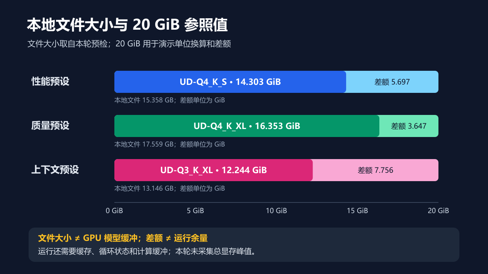
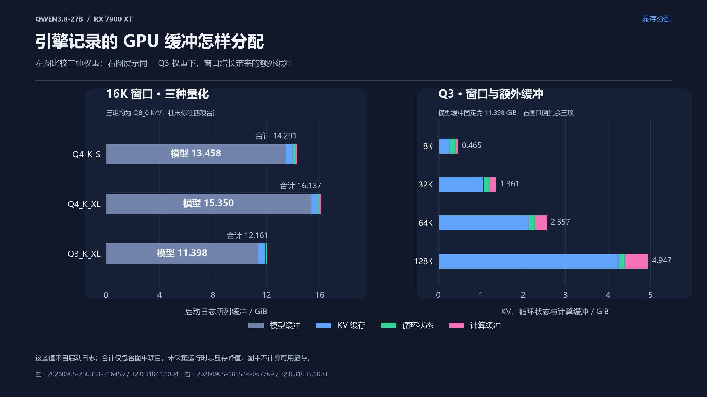
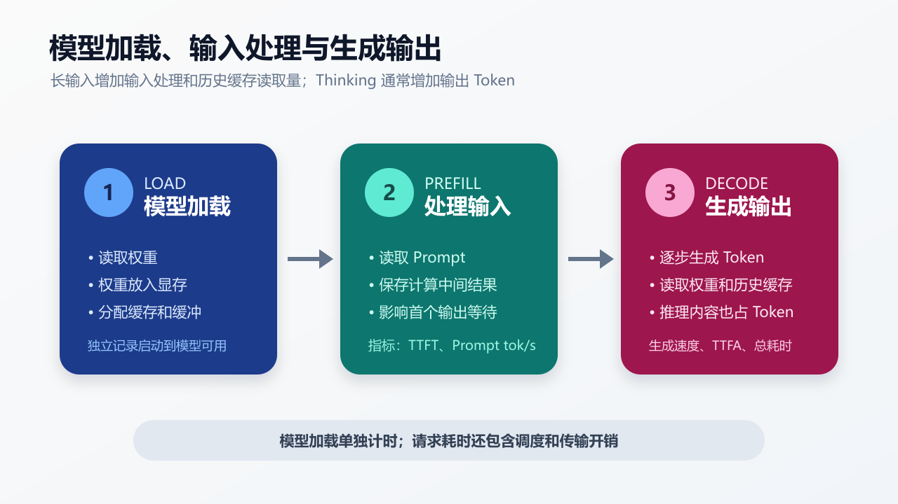
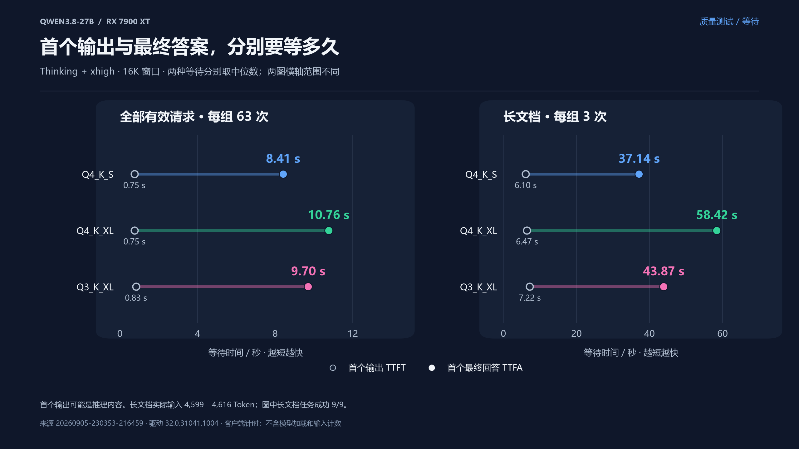
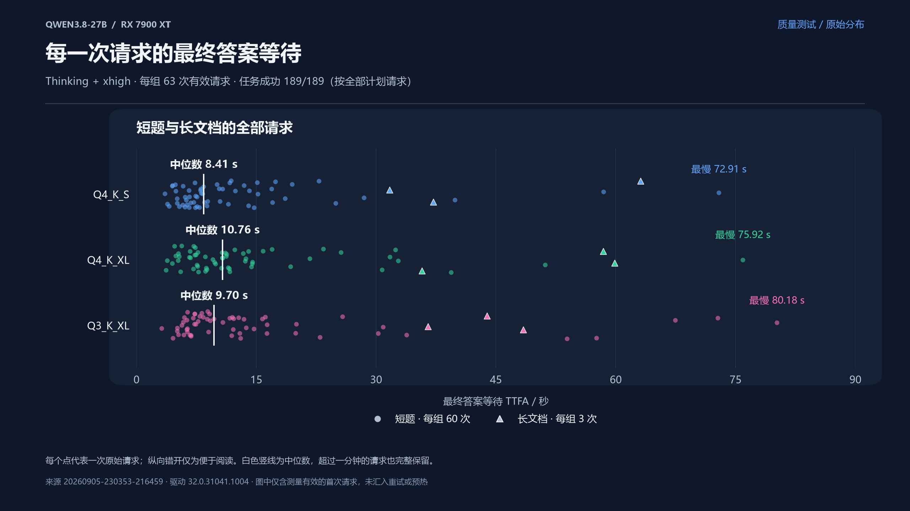
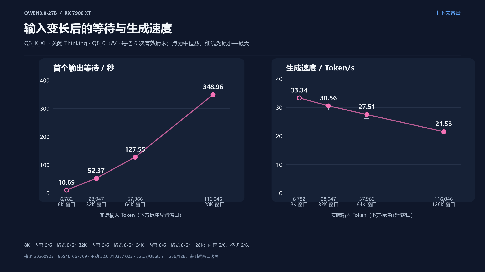

# 27B 模型如何塞进 20GB 显存

量化、上下文与性能权衡 · 修订日期：2026-09-06



> 分享环境：AMD Radeon RX 7900 XT（标称 20 GB 显存）、32 GB 系统内存；模型 Qwen3.8-27B；工具 Unsloth Desktop / Run。
>
> 实测日期：2026-09-05。文中分别标注理论估算、引擎日志和请求测量；完整数据见[本机实测报告](Qwen3.8-27B本机实测报告.md)。
>
> 实测包含共同性能、上下文容量和 Thinking＋xhigh 质量三部分。性能与容量沿用已完成的测试，质量替换为三组各 63/63 成功的新结果；各部分的来源和环境见第 8.3 节。

对后端开发来说，本地大模型可以作为一个 HTTP 服务来使用：提交输入，接收生成结果。部署时，多了一项需要仔细分配的资源——显卡自己的内存，也就是**显存**。

这次分享从一次请求讲起，说明模型为什么占用大量显存、量化能省下多少空间，以及省下的空间怎样影响输入长度、速度和回答质量。基础术语会在用到时解释，不需要提前学习模型训练。

建议正文讲 **40 分钟，另留 10 分钟展示实测、10 分钟问答**。

| 环节 | 时间 | 主要内容 |
|---|---:|---|
| 推理接口与模型文件 | 8 分钟 | 参数、Token、部署工具和模型类型 |
| 权重量化 | 7 分钟 | 数值精度、文件大小与质量损失 |
| 显存与上下文 | 10 分钟 | 缓存为什么增长，怎样估算占用 |
| 请求耗时与生成参数 | 7 分钟 | 首个输出、生成速度和 Thinking |
| 配置与测试 | 8 分钟 | 比较三套配置，检查实际运行结果 |

## 1. 从一个推理接口说起

### 1.1 模型、参数与推理

**模型**由计算结构和训练得到的参数组成。结构规定怎样计算，参数决定计算时使用哪些数值。使用训练好的模型处理输入、生成结果，称为**推理（Inference）**。

模型的计算通常按层依次进行，每层接收上一层的输出并继续处理。模型的大部分参数是**权重（Weights）**，通常按**张量（Tensor）**保存。这里可以把张量理解为存放数值的多维数组：一维叫向量，二维叫矩阵。

Qwen3.8-27B 中的 **27B** 表示约 270 亿个参数，B 是 billion，即十亿。如果每个参数用 2 字节保存，仅参数数据就需要：

```text
270 亿 × 2 字节 = 540 亿字节 = 54 GB
```

这已经超过这张显卡的容量。后面会看到，减少每个权重使用的位数，可以缩小文件；模型运行时还需要额外空间。

### 1.2 一段文本怎样进入模型

模型处理的是 Token 编号。**Token** 是文本切分后的单位，可能对应一个字、一个词或词的一部分；**分词器（Tokenizer）**负责文本与这些编号之间的转换。不同分词器的切分方式不同，不能把 Token 数固定换算成字数。

接口中的 `messages` 还要经过**聊天模板（Chat Template）**处理。模板按模型约定的格式组织系统提示、用户输入和历史回答，并加入角色标记、分隔符等内容。这些标记也占 Token。

交给模型的完整输入称为 **Prompt**。**上下文窗口（Context Window）**则是一次推理能够容纳的 Token 数量上限，输入、历史内容和新生成的内容共同占用它。

因此，8K 窗口不能直接理解为“可以输入 8K Token”：还要为回答留空间。本文上下文长度中的 K 按 1,024 计算，8K 就是 8,192 Token。

### 1.3 哪些软件负责运行模型

**GGUF** 是模型文件格式，保存权重、分词器和描述模型的元数据。**llama.cpp** 是推理引擎，负责读取文件并执行计算。**Unsloth Desktop / Run** 负责模型管理、服务启动和界面/API。

推理引擎通过 HIP、Vulkan 等接口调用 GPU。HIP 面向 GPU 并行计算，Vulkan 同时提供图形和计算接口。本文把引擎调用这些接口的实现称为**硬件后端**。将部分或全部模型计算交给 GPU，并把对应权重放入显存，通常称为 **GPU Offload（GPU 卸载）**。

应用层可以是聊天界面，也可以是 **Agent**：由模型参与选择并调用搜索、代码执行等工具，完成多步任务的程序。



| 名称 | 本次部署中的作用 |
|---|---|
| Qwen3.8-27B | 提供模型结构和训练好的参数 |
| GGUF | 保存模型数据的文件格式 |
| Unsloth Dynamic Quant | 按张量对量化误差的敏感程度选择精度，详见第 2 节 |
| Unsloth Desktop / Run | 管理模型、启动服务、提供界面或 API |
| llama.cpp 兼容引擎 | 加载模型，管理缓存并组织计算 |
| HIP / Vulkan 等硬件后端 | 调用 GPU 完成计算，实际使用哪一种需查看日志 |

图中的箭头表示请求的执行路径。模型结构、权重和分词器是引擎读取的材料。

### 1.4 选模型时常见的几组名称

这些名称描述不同方面，可以组合出现。

| 区分什么 | 名称与含义 | 部署时关注什么 |
|---|---|---|
| 是否经过指令训练 | **Base（基础模型）**主要经过预训练，擅长续写；**Instruct（指令模型）**又接受了指令等后续训练，更适合按要求回答 | 做对话服务时，要选适合指令任务的模型，并使用匹配的聊天模板 |
| 每个 Token 怎样计算 | **Dense（稠密模型）**使用固定的计算路径；**MoE（混合专家模型）**会为当前 Token 选择部分专家子网络参与计算 | MoE 的每步计算量可以小于其总参数规模，但专家权重通常仍需存储 |
| 能接收什么输入 | **文本模型**主要处理文本；**多模态模型**还能处理图片、音频或视频中的一种或多种 | 额外的输入处理组件和输入 Token 都可能增加占用 |

本文使用的 Qwen3.8-27B 面向指令与对话任务，属于稠密模型，也支持图片和视频输入。它的语言部分采用混合注意力结构，第 4 节会结合显存公式说明。[官方模型卡](https://huggingface.co/Qwen/Qwen3.8-27B)。

## 2. 权重量化

### 2.1 用多少位保存一个数

后端开发常见的 32 位浮点格式称为 **FP32**。**FP16** 和 **BF16** 都用 16 位，也就是 2 字节保存一个数。位数减少后，可表示的数值也会受到更多限制。

浮点数的符号位表示正负，指数位主要影响数值范围，小数位主要影响精度。

| 格式 | 符号位 | 指数位 | 小数位 | 特点 |
|---|---:|---:|---:|---|
| FP16 | 1 | 5 | 10 | 在相同数量级附近能区分更细的数值，但范围较小 |
| BF16 | 1 | 8 | 7 | 范围接近 FP32，但在相同数量级附近的精度较低 |

例如在 [1, 2) 区间内，FP16 相邻数值的间隔是 2⁻¹⁰，约 0.00098；BF16 是 2⁻⁷，约 0.0078。无法精确表示的值需要舍入。

本文把尚未转为 Q8、Q4 等低位格式的 BF16/FP16 权重称为“未量化权重”。这个称呼不表示它们没有舍入误差。

### 2.2 Q4 为什么能缩小文件

**量化（Quantization）**用较少的位数近似保存原来的数值。例如，4 bit 只有 16 种编码，配合每组数值的缩放参数，可以表示一组近似值。保存的数据更少，但恢复出的数值通常与原值有差异。

模型名称中的 **Q8、Q4、Q3** 表示量化格式的名义位宽。理解文件大小时，可以先按每个参数分别占 8、4、3 bit 估算，再加上其他开销。

| 每参数理论位数 | 270 亿参数的大小 / GB |
|---:|---:|
| 16 bit | 54.0 |
| 8 bit | 27.0 |
| 4 bit | 13.5 |
| 3 bit | 10.125 |

实际文件还要保存缩放参数、元数据和对齐填充，也可能让部分张量保留较高精度。例如，**嵌入层（Embedding）**把 Token 编号转换成数值向量，**输出层**把内部计算结果转换成下一个 Token 的分数；这些张量可以采用与其他权重不同的精度。

所以，Q4 文件的平均每参数占用不一定恰好是 4 bit。

### 2.3 怎样读量化文件名

以 `UD-Q4_K_XL` 为例：

| 部分 | 含义 |
|---|---|
| UD | Unsloth Dynamic Quant，按张量对量化误差的敏感程度分配精度 |
| Q4 | 名义位宽为 4 bit |
| K | 一类分块量化格式 |
| S / M / XL | 同一量化系列中不同的精度配置；通常 S 偏小，M 居中，Unsloth 的 XL 更重视敏感张量 |

这些后缀适合用来识别配置。比较不同模型时，还要查看实际文件大小和张量类型，不能只按后缀判断速度或质量。

### 2.4 文件更小，是否也会更快

较小的权重能减少显存读取量，但计算也有成本。**算子**是矩阵乘法等具体运算，**内核（Kernel）**是在 GPU 上执行这些运算的程序。后端有没有高效的量化内核，会影响实际速度。

把量化编码还原为参与计算的近似数值称为**反量化**，它也需要计算。若部分权重留在系统内存，CPU 计算和 CPU/GPU 之间的数据传输还可能拖慢推理。因此，Q3 与 Q4 的速度关系需要在目标设备上测试。

量化后的回答也要检查：答案是否正确，代码是否符合要求，输出格式是否完整，长文档中的记录是否找对。文件大小、运行速度和任务正确率应一起比较。

## 3. 显存里还要放什么

### 3.1 统一文件和显存的单位

**1 GB = 10⁹ 字节；1 GiB = 2³⁰ 字节。** 网站通常用十进制 GB 展示文件大小，监控工具可能用 MiB 或 GiB。做减法前，先将它们换成同一单位。

本次 Q4_K_XL 文件为 17,559,178,144 字节。用 20 GiB 作为容量参照，可以这样计算：

```text
文件：17,559,178,144 / 2³⁰ ≈ 16.353 GiB
差额：20.000 − 16.353 ≈ 3.647 GiB
```

这 3.647 GiB 只是参照容量减去文件大小的算术差。20 GiB 在此用于演示，本轮未采集设备总显存的字节数。加载后的 GPU 权重占用也可能与文件大小不同，不能将差额直接作为上下文的可用空间。



| 量化版本 | 文件大小 / GB | 换算为 GiB | 本次选择它的理由 |
|---|---:|---:|---|
| UD-Q4_K_S | 15.358 | 14.303 | 权重较小，尝试兼顾速度与显存余量 |
| UD-Q4_K_XL | 17.559 | 16.353 | 为敏感张量保留更多精度 |
| UD-Q3_K_XL | 13.146 | 12.244 | 减少权重占用，为更长输入留空间 |

以上由本地文件的实际字节数换算，保留三位小数。三份文件的大小和 SHA256 已在[模型预检记录](context-benchmark/runs/20260905-230353-216459/model-preflight.json)中保存。[GGUF 文件来源](https://huggingface.co/unsloth/Qwen3.8-27B-GGUF)。

### 3.2 权重之外的占用

模型生成新内容时，会反复使用前文。为减少重复计算，引擎会保存前文的一部分计算结果，**KV Cache（键值缓存）**就是其中一类。它与直接缓存整个接口回答的用途不同。第 4 节会展开解释 K、V 及其大小。

本模型的一部分层还使用**循环状态**：每处理一步，就更新并保留一组中间数值。它们与 KV Cache 的存储方式不同，也需要占用空间。

此外，运算要保存临时结果，这部分空间称为**计算缓冲**。加上推理引擎、桌面和其他程序的占用，可以得到下面的估算：

```text
设备显存占用 ≈ GPU 上的权重
             + KV Cache
             + 循环状态
             + 计算缓冲与引擎开销
             + 视觉组件（启用时）
             + 桌面及其他程序占用
```

模型能加载，只说明加载阶段分配成功。处理长输入时可能需要更多临时空间；分配失败会出现 **OOM（Out Of Memory，内存或显存不足）**。因此，不能把文件放入显存后的差额全部留给上下文。

### 3.3 本机日志中的分配



左图比较相同 16K 窗口下的分配；右图固定 Q3 权重，单独展示 KV、循环状态和计算缓冲。各项数据如下。

23:03 开始的质量补测中，三组均使用 16K 窗口。引擎启动日志记录了下面几项 GPU 缓冲，单位均为 GiB：

| 权重与窗口 | 模型缓冲 | KV Cache | 循环状态 | 计算缓冲 |
|---|---:|---:|---:|---:|
| Q4_K_S，16K | 13.458 | 0.531 | 0.146 | 0.157 |
| Q4_K_XL，16K | 15.350 | 0.531 | 0.146 | 0.110 |
| Q3_K_XL，16K | 11.398 | 0.531 | 0.146 | 0.086 |

在相同窗口和缓存精度下，三组的 KV Cache 与循环状态大小一致，Q3 的模型缓冲最小。计算缓冲还受到 Batch/UBatch 等配置影响，第 5 节会解释这两个参数。

18:55 开始的性能与容量测试还记录了同一 Q3 权重在不同窗口下的分配，单位同为 GiB：

| 权重与窗口 | 模型缓冲 | KV Cache | 循环状态 | 计算缓冲 |
|---|---:|---:|---:|---:|
| Q3_K_XL，8K | 11.398 | 0.266 | 0.146 | 0.053 |
| Q3_K_XL，32K | 11.398 | 1.063 | 0.146 | 0.153 |
| Q3_K_XL，64K | 11.398 | 2.125 | 0.146 | 0.285 |
| Q3_K_XL，128K | 11.398 | 4.250 | 0.146 | 0.551 |

窗口从 8K 增至 128K，权重占用保持不变，KV Cache 从 0.266 GiB 增至 4.250 GiB，计算缓冲也随之增加。这说明量化省下的权重空间，可以用于容纳更大的缓存和缓冲。

日志也记录了主机内存缓冲。表中各项不能替代运行时的总显存峰值；两轮均未采集监控数据，峰值显存和系统内存保留为未测。记录来源见[实测报告](Qwen3.8-27B本机实测报告.md)。

## 4. 上下文与 KV Cache

### 4.1 从注意力理解 K 和 V

生成下一个 Token 时，模型需要利用前文。**注意力（Attention）**通过计算相关程度，决定怎样组合前文的信息。

模型为当前处理的 Token 计算一个**查询向量 Query（Q）**，用它与前文的**键向量 Key（K）**比较，再按匹配程度组合对应的**值向量 Value（V）**。Q、K、V 都是一组数值。生成新 Token 时，历史 Token 的 K 和 V 可以复用，所以引擎会保存它们。

**Full Attention（完整注意力）**能够读取当前窗口内的完整历史。历史越长，要保存的 K/V 通常越多。

Qwen3.8-27B 还使用线性注意力层，通过更新循环状态处理历史信息。它与逐 Token 保存完整 K/V 的方式不同。因此，估算这款模型时，要把两类存储分开。

### 4.2 把模型结构代入公式

模型中的一个 **block** 是一组连续执行的计算模块，通常简称一层。多个 block 依次处理输入。Qwen3.8-27B 的语言部分有 64 层，按三层线性注意力、一层完整注意力排列，共 **48 层线性注意力、16 层 Full Attention**。

完整注意力层有 **4 个 KV 头**，每个头 **256 维**。可以把 KV 头理解为分组存储的 K/V 通道；256 维表示每个头的 K 和 V 各用 256 个数表示。于是，每个 Token 在一层中需要保存 `4 × 256 × 2` 个数，最后的 2 分别对应 K 和 V。[官方配置](https://huggingface.co/Qwen/Qwen3.8-27B/blob/main/config.json)。

单条序列、K/V 使用相同格式时：

```text
Full Attention K/V 字节数
≈ T × 16 层 × 4 个 KV 头 × 256 维 × K/V 两份 × 每个数的平均字节数

F16：2 字节（这里的 F16 即 FP16）
Q8_0：34 / 32 字节
Q4_0：18 / 32 字节
```

Q8_0 每 32 个数占 34 字节，Q4_0 每 32 个数占 18 字节，都包含块缩放参数。因此，它们的大小不是 F16 的精确二分之一或四分之一。[GGML 格式定义](https://github.com/ggml-org/llama.cpp/blob/master/ggml/src/ggml-common.h)。

| T：可存放的 Token 数 | F16 / GiB | Q8_0 / GiB | Q4_0 / GiB |
|---:|---:|---:|---:|
| 8,192 | 0.500 | 0.266 | 0.141 |
| 16,384 | 1.000 | 0.531 | 0.281 |
| 32,768 | 2.000 | 1.063 | 0.563 |
| 65,536 | 4.000 | 2.125 | 1.125 |
| 131,072 | 8.000 | 4.250 | 2.250 |

这张表只计算 16 层 Full Attention 的 K/V，不包含其余 48 层的状态、对齐填充、计算缓冲和权重。它说明缓存随长度怎样增长，不能直接作为整机显存占用。

引擎可能在加载时按配置窗口预分配缓存。估算这种分配时，T 应使用实际分配的容量；分析某条序列的数据规模时，才使用已有输入和生成长度。多个请求如果共用一个缓存池，统计了池的总容量后，不应再乘一次并发数。

### 4.3 输入与输出共用窗口

有些模型会先生成用于推理的内容，再生成最终回答，这种模式称为 **Thinking**。**Non-Thinking** 则直接生成回答。Thinking 产生的 Token 也占上下文空间。

```text
实际输入（系统提示、历史、用户输入和模板标记等）
+ 新生成的推理内容与最终回答
≤ 实际上下文窗口
```

当前质量测试的长输入目标为 4,600 Token，Thinking 与最终回答共用 8,192 Token 输出上限。质量窗口设为 16,384；加上 64 Token 输入容差和 128 Token 安全余量，总预算为 12,984，可以放入窗口。实际输入仍在每次请求前重新计数。

共同性能测试采用另一组样本：输入目标 6,800，输出上限 192。它与质量测试的输出需求不同，所以分别准备输入，已完成的结果见第 8.4 节。

### 4.4 窗口有多大，任务就能用多长吗

Qwen3.8-27B 官方原生窗口为 262,144 Token，即 256K。本机能分配多大的窗口，要看显存和引擎；长输入中的信息能否被正确使用，要靠任务测试。[官方模型卡](https://huggingface.co/Qwen/Qwen3.8-27B)。

报告应同时写出**配置窗口、实际输入长度、任务结果**。本机的 Q3 容量测试使用 128K 窗口，实际输入为 116,043～116,057 Token，并通过了五项检索。这说明该任务在这个输入长度下完成，接近窗口上限时仍需另测。

权重量化和 KV 量化也要分别设置。例如，模型用 Q4，缓存仍可用 F16 或 Q8。降低缓存精度可以减少占用，但更换后要重新检查长文档检索和回答质量。

## 5. 一次请求的耗时

### 5.1 加载、输入处理与生成

模型加载时，引擎读取权重、将相应数据放入显存，并分配缓存和缓冲。模型保持加载后，后续请求通常可以复用它。

一次生成请求主要有两个计算阶段：**Prefill（输入处理）**先处理完整 Prompt、建立缓存；**Decode（解码生成）**再根据已有状态逐步生成 Token。普通自回归解码会把已生成的 Token 接到前文后面，再继续预测下一个 Token。



长输入会增加 Prefill 的工作量，也会让完整注意力在 Decode 时读取更多历史 K/V。Thinking 则通常增加要生成的 Token 数。两者都可能延长请求，但影响的环节不同。

### 5.2 分别记录哪些时间

服务通过 **SSE（Server-Sent Events）**逐块返回生成内容。一个内容块可能包含多个 Token，所以脚本实际观察的是内容块到达时间。

| 指标 | 本文采用的含义 |
|---|---|
| 启动到模型可用 | 服务启动、模型加载和缓存分配所用时间，单独记录 |
| TTFT（Time To First Token） | 脚本用“请求发出到收到第一个文本或推理内容块”的时间近似表示 |
| TTFA（Time To First Answer） | 请求发出到收到第一个最终回答内容块的时间 |
| Prefill tok/s | 每秒处理的输入 Token 数，优先取引擎返回的值 |
| Decode tok/s | 每秒生成的 Token 数，优先取引擎返回的值 |
| 请求总时间 | 从请求发出到流正常结束，包含调度和传输开销 |

开启 Thinking 后，先收到推理内容，并不表示已经收到最终答案。TTFT 与 TTFA 一起记录，才能区分这两段等待。

引擎没有返回速度时，脚本另存客户端估算值：输入 Token / TTFT，以及 `(输出 Token−1) / 首末内容块之间的时间间隔`。这些值受调度、网络和流分块影响，不能与引擎测速值混在一起求中位数。

**ITL（Inter-Token Latency）**是相邻输出 Token 之间的时间间隔。由于 SSE 块与 Token 不是一一对应，当前脚本不报告逐 Token ITL。共同性能方案每组安排六次正式请求，因此报告中位数、范围和有效样本数，不报告 p95 等尾部延迟统计。

### 5.3 Batch、UBatch 与预热

**Batch** 是引擎一次组织处理的 Token 数量；**UBatch（Micro-batch）**是实际送入计算的小批量。例如 Batch=1,024、UBatch=256，表示一个逻辑批量可以拆成更小的计算批量。这里的 Batch 不能直接当作 HTTP 并发请求数。

增大批量可能提高 Prefill 吞吐，也可能增加临时缓冲。**Flash Attention** 是减少注意力中间数据存储和读写的一种计算方法；是否启用，要查看引擎日志。

正式测速前，用相近长度的输入预热一次，让首次使用带来的初始化尽量不影响正式结果。预热结果单独保存。

加载测试也要考虑操作系统文件缓存。“第一次启动进程”不一定意味着模型必须从磁盘重新读取。当前流程只记录启动到可用时间，冷、热加载对比需要另行控制缓存条件。

## 6. Thinking 与生成参数

### 6.1 推理档位和输出上限

Qwen3.8 的官方聊天模板接受 `reasoning_effort="low" / "medium" / "xhigh"`，默认是 `xhigh`。其中 `reasoning_effort` 是控制推理行为的参数，不代表固定的 Token 配额。模板没有 `high` 档位。[官方聊天模板](https://huggingface.co/Qwen/Qwen3.8-27B/raw/main/chat_template.jinja)。

日常使用固定开启 Thinking，因此当前三组质量测试都传入 `enable_thinking=true`、`reasoning_effort="xhigh"`。共同性能和容量测试传入 `enable_thinking=false`，用于测量处理速度和输入容量。语料生成、输入计数和正式生成使用同一组模板相关参数。

`max_tokens` 限制新生成的 Token 数，推理内容和最终回答都需要使用这份预算。服务返回的 **usage** 记录 Token 用量，**finish_reason** 记录结束原因。

若 `finish_reason=length`，说明输出达到了上限。此时要记录“输出预算耗尽”：它可能尚未生成最终答案，不能仅凭这一结果判断模型不会做题。本轮统一设置 8,192 输出上限，最高实际输出为 2,759 Token，全部以 `stop` 正常结束。更难的任务仍需检查是否有足够预算。

### 6.2 采样参数控制怎样选 Token

模型会为下一个 Token 给出一组分数，生成程序再从候选 Token 中选择一个。这个选择过程称为**采样（Sampling）**。

| 参数 | 作用 |
|---|---|
| Temperature | 调整概率分布的集中程度；通常越低越偏向高分候选，越高选择越分散 |
| Top-k | 只保留分数最高的 k 个候选 |
| Top-p | 按概率从高到低保留候选，直到累计概率达到 p |
| Presence Penalty | 按 Token 是否已出现过调整惩罚，正值可降低重复倾向 |
| Seed | 随机种子，用来固定随机数生成的起点 |

质量测试统一采用官方建议的 Thinking 采样参数；共同性能和容量测试另用固定采样设置。[Qwen 官方建议](https://huggingface.co/Qwen/Qwen3.8-27B)。

| 测试用途 | Temperature | Top-p | Top-k | Presence Penalty |
|---|---:|---:|---:|---:|
| 三组质量，Thinking＋xhigh | 1.0 | 0.95 | 20 | 0.0 |
| 共同性能与容量，关闭 Thinking | 0.0 | 1.0 | 1 | 0.0 |

固定 Seed 有助于复现，但后端、驱动或计算批量改变后，仍可能得到不同结果。采样设置也会影响答案，因此三组质量测试使用相同采样参数和种子。

## 7. 配置与对比

### 7.1 三套配置分别怎样测试

下面三套预设分别以速度、回答质量和长上下文为设计目标。共同性能使用相同输入测速，质量测试统一 Thinking＋`xhigh`，上下文预设另外测试更长输入。

| 参数 | 性能优先 | 质量优先 | 上下文优先 |
|---|---|---|---|
| 权重 | UD-Q4_K_S | UD-Q4_K_XL | UD-Q3_K_XL |
| 共同性能窗口 | 8,192 | 8,192 | 8,192 |
| 质量测试窗口 | 16,384 | 16,384 | 16,384 |
| K/V | Q8_0 / Q8_0 | Q8_0 / Q8_0 | Q8_0 / Q8_0 |
| Batch / UBatch | 1,024 / 512 | 512 / 256 | 256 / 128 |
| 质量 Thinking | 开启，xhigh | 开启，xhigh | 开启，xhigh |
| 质量输出上限 | 8,192 | 8,192 | 8,192 |
| 追加容量窗口 | — | — | 32K、64K、128K |

共同性能与容量均关闭 Thinking，输出上限为 192。各部分的实际设置分别见[性能与容量配置快照](context-benchmark/runs/20260905-185546-067769/source-snapshot/effective-config.json)、[质量配置快照](context-benchmark/runs/20260905-230353-216459/source-snapshot/effective-config.json)。

同类测试在三组间使用相同输入和生成参数。权重和 Batch 仍有差异，结果用于比较整套配置。要知道某项参数的影响，就做**控制变量对比**：保持其他条件一致，再改变其中一项。`-WithAblations` 提供权重量化、KV 精度和 Batch/UBatch 对照，这些附加阶段尚未执行。

### 7.2 检查真正生效的配置

脚本在手动模式下传入 `gpu_layers=999`，请求尽可能多地把层放到 GPU。999 是请求上限，实际层数取决于模型和引擎。

本模型的语言主干有 64 个 block。本轮 GGUF 还包含 1 个用于预测后续 Token 的附加层，日志给出 `n_layer=64`、`n_layer_all=65`；卸载计数再包含输出层，所以报告 `offloaded 66/66 layers to GPU`。这些数字的计数范围不同。检查是否全部卸载时，要看后端的 N/N 记录、实际设备和 CPU/GPU 缓冲。[llama.cpp 卸载实现](https://github.com/ggml-org/llama.cpp/blob/master/src/llama-model.cpp)。

有些状态字段只是原样返回启动时传入的值。脚本会把启动参数与实际运行信息分开保存：实际值不一致就停止该阶段；没有足够信息时记为 `unknown`（未知），最终标为 `unverified`（尚未确认配置）。

本轮还请求关闭几项会改变实验条件的功能：

| 功能 | 含义 | 关闭的原因 |
|---|---|---|
| Prompt Cache | 在不同请求之间复用相同输入前缀的计算结果 | 每次正式测试都完整处理输入 |
| Context Shift | 窗口满后移出部分旧 Token，让生成继续 | 避免测试输入在运行中被移出 |
| 视觉投影（mmproj） | 将视觉特征转换为语言模型可接收的表示 | 本轮只测文本任务 |
| 推测解码（Speculative Decoding） | 先提出候选 Token，再由目标模型验证 | 先测常规生成流程，便于比较 |

这些设置是否生效仍以引擎实际信息为准。模型支持视觉输入，不代表本次已经加载视觉组件。

本文引用的九个阶段均有 11 项自动检查通过、4 项待确认。日志已确认模型文件、窗口、Batch/UBatch、Q8 K/V、Flash Attention，以及 `offloaded 66/66 layers to GPU`；上表四项仍未被自动核验，原始结果均保留 `unverified`。其中，底层日志明确写出未配置推测解码实现，可作为补充证据，详见[实测报告](Qwen3.8-27B本机实测报告.md)。

### 7.3 怎样判断结果

本轮质量测试用于检查基础任务和接口输出，按全部计划请求统计四个比率：

| 指标 | 说明 |
|---|---|
| 运行完成率 | 请求正常返回完整结果的比例 |
| 内容正确率 | 输入和输出均通过测量检查，且答案内容正确的比例 |
| 格式合规率 | 输入和输出均通过测量检查，且 JSON 字段、类型和结构正确的比例 |
| 任务成功率 | 同时满足测量有效、内容正确和格式合规的比例 |

测量有效要求流完整、输入计数与 usage 一致、上下文空间足够、输出非空且未因输出上限而结束。运行完成只表示传输结束；答案正确与否另行判断。

例如，计划执行三次，一次正确、两次超时，任务成功率就是 **1/3**。三次都返回同一个错误答案，内容正确率就是 **0**。

短题有快速检查版的 4 道题和扩展版的 20 道题，覆盖计算、代码修复、约束推理和按要求筛选记录。代码修复题比较 **AST（抽象语法树）**，即代码解析后的结构，避免仅因空格或多余括号不同而判错；这不等于验证任意代码的语义是否相同。

长文档测试要求按项目名找到正确记录，并加入失效版本、相似名称和缺失答案。它可以帮助筛选本机配置，但题目数量和类型有限，不能代替更完整的模型评估。

容量测试另外检查五个目标位置的检索结果：全部请求测量有效、JSON 格式正确、总体检索正确率至少 90%，且每个位置至少在 2/3 请求中正确。文档里标明目标插入位置和实际 Token 位置估计，详细规则见[测试方案](Qwen3.8-27B上下文与性能测试方案.md)。

## 8. 演示与结果

### 8.1 调用一次推理接口

测试脚本默认使用 **8001** 端口；Desktop 服务可能使用 8888 或其他端口，以实际监听端口为准。先启动已下载的模型，将本机生成的 Key 放入 `UNSLOTH_API_KEY`，再从接口读取模型 ID。

下面按日常使用方式开启 Thinking、设置 `xhigh`。服务窗口设为 16K，为推理和最终回答预留 8,192 Token；示例使用非流式请求，会等生成结束后一次返回。

```powershell
$baseUrl = 'http://127.0.0.1:8001'
$headers = @{ Authorization = "Bearer $env:UNSLOTH_API_KEY" }
$models = Invoke-RestMethod -Uri "$baseUrl/v1/models" -Headers $headers
$body = @{
    model = $models.data[0].id
    messages = @(@{ role = 'user'; content = '请用一句话解释模型量化。' })
    enable_thinking = $true
    reasoning_effort = 'xhigh'
    enable_tools = $false
    max_tokens = 8192
    temperature = 1.0
    top_p = 0.95
    top_k = 20
    presence_penalty = 0.0
    stream = $false
} | ConvertTo-Json -Depth 10
Invoke-RestMethod -Uri "$baseUrl/v1/chat/completions" -Method Post `
    -Headers $headers -ContentType 'application/json; charset=utf-8' `
    -Body ([System.Text.Encoding]::UTF8.GetBytes($body))
```

讲稿和截图使用占位或脱敏 Key。脚本会脱敏结构化结果及已结束阶段日志中的 Unsloth Key，分享前仍检查最终导出内容。

### 8.2 运行测试

按当前方案执行完整测试：

```powershell
Set-Location 'E:\codex\技术分享\context-benchmark'
# 检查共同性能、质量和容量的完整计划。
.\run_full_benchmark.ps1 -Suite extended -DryRun
# 正式执行完整测试。
.\run_full_benchmark.ps1 -Suite extended
# 仅补测三组 Thinking + xhigh 质量时，使用这一条。
.\run_full_benchmark.ps1 -Stage quality -Suite extended
```

`-DryRun` 不启动服务、推理、下载或计算模型哈希。本机三份模型路径已写入配置；换机器时修改 `local_model_files`，或通过 `-ModelDir` 指定目录。正式运行会在计时前完成模型预检和哈希计算。

完整操作、结果字段和恢复方式见[测试方案](Qwen3.8-27B上下文与性能测试方案.md)及[脚本说明](context-benchmark/README.md)。

### 8.3 数据来自哪几次测试

性能与容量已经完成，随后单独补测了三组 Thinking＋xhigh 质量。本文按测试类型采用对应记录：

| 结果 | 来源运行 | 采用范围 | GPU 驱动 |
|---|---|---|---|
| 共同性能与容量 | [20260905-185546-067769](context-benchmark/runs/20260905-185546-067769/summary.md)，18:55 开始 | 六个阶段，36 次有效请求；Q3 的 8K 同时用于性能与容量 | 32.0.31035.1003 |
| Thinking＋xhigh 质量 | [20260905-230353-216459](context-benchmark/runs/20260905-230353-216459/summary.md)，23:03 开始 | 三个阶段，189 次有效请求，全部任务成功 | 32.0.31041.1004 |

两轮均使用 Unsloth 2026.9.2 和相同模型文件；驱动及输入、输出条件不同，各张表在对应批次内比较。先前生成条件不同的质量成绩已由 xhigh 结果替换。

以下九个阶段的配置核验仍保留第 7.2 节列出的未知项。可选控制变量对比、边界输入与 RAG 尚未执行，完整证据见[本机实测报告](Qwen3.8-27B本机实测报告.md)。

### 8.4 相同输入下的共同性能

三组均为 8K 窗口、Q8 K/V、关闭 Thinking，使用相同采样和 192 输出上限。三份文本各重复两次，实际输入为 6,778～6,786 Token。下表每组有六次有效请求，时间和速度均为中位数：


柱长表示中位数，细线表示本组的最小值到最大值。两项速度分别使用自己的横轴。

| 指标 | Q4_K_S | Q4_K_XL | Q3_K_XL |
|---|---:|---:|---:|
| 引擎 Prefill / Token/s | 780.85 | 733.39 | 649.66 |
| 引擎 Decode / Token/s | 34.00 | 31.17 | 33.34 |
| TTFT / TTFA / 秒 | 8.87 / 8.87 | 9.48 / 9.48 | 10.69 / 10.69 |
| 请求总耗时 / 秒 | 11.99 | 12.80 | 13.91 |
| 实际输出 Token 范围 | 101～108 | 101～108 | 106～113 |
| 检索项正确数 | 30/30 | 30/30 | 30/30 |
| 严格 JSON 合规请求 | 6/6 | 6/6 | 0/6 |

Q4_K_S 的 Prefill 和 Decode 中位数均最高。Q3 的权重更小，在这组三套预设中却没有更快；Batch/UBatch 也不同，不能将速度差单独归因于量化位数。

Q3 的六次回答均找对记录，但附加了 Markdown 代码块，因此格式未通过。测速仍有效，它兼任的 8K 容量判定则因格式失败。这些请求关闭 Thinking，与下面的 xhigh 质量结果分开记录。

### 8.5 Thinking＋xhigh 的基础任务与接口格式检查

每组有 20 道短题，各用三个种子执行，再加三份长文档，共 63 次请求。短题输入为 111～145 Token，长文档为 4,599～4,616 Token；三组对应输入一致。

| 指标 | Q4_K_S | Q4_K_XL | Q3_K_XL |
|---|---:|---:|---:|
| 正常返回 / 计划请求 | 63/63 | 63/63 | 63/63 |
| 测量有效 / 计划请求 | 63/63 | 63/63 | 63/63 |
| 内容正确 | 63/63（100%） | 63/63（100%） | 63/63（100%） |
| 格式合规 | 63/63（100%） | 63/63（100%） | 63/63（100%） |
| 任务成功 | 63/63（100%） | 63/63（100%） | 63/63（100%） |
| 输出预算耗尽 | 0 次 | 0 次 | 0 次 |

评分仍要求纯 JSON，字段、类型和嵌套结构正确。计算、定点代码修复、约束推理、记录筛选和长文档检索均通过，包括失效版本、相似名称和缺失项的判断。

对于这组基础题，开启 Thinking、使用 `xhigh` 后全部通过符合预期。**三套配置都满足了本轮的基础任务与接口格式要求。** 接下来更值得比较的是：完成同样的任务，各需要等多久、生成多少 Token，以及占用多少显存。

### 8.6 开启 Thinking 后的等待

下表每组有 63 次有效请求，时间和速度均为中位数；总耗时最大值另列。TTFT、TTFA 和总耗时取客户端观察，Decode 取引擎计时。



空心点为首个输出，实心点为首个最终回答。左图统计全部 63 次请求，右图统计其中的三份长文档；两图横轴范围不同。

| 指标 | Q4_K_S | Q4_K_XL | Q3_K_XL |
|---|---:|---:|---:|
| 收到首个输出：TTFT / 秒 | 0.75 | 0.75 | 0.83 |
| 收到首个最终回答：TTFA / 秒 | 8.41 | 10.76 | 9.70 |
| 请求总耗时 / 秒 | 9.00 | 11.31 | 10.08 |
| 请求总耗时最大值 / 秒 | 73.48 | 76.68 | 80.88 |
| 总输出 Token 中位数 | 290 | 339 | 310 |
| 引擎 Decode / Token/s | 35.11 | 32.17 | 34.29 |

在这批任务中，Q4_K_S 的总体 TTFA 和总耗时中位数最短。Q3 的文件最小，但最终答案等待中位数更长。三组生成长度和 Batch 不同，因此这些数据比较的是整套配置；表中速度来自质量请求，第 8.4 节另列了固定输入的共同性能结果。



每个点是一条原始请求，三角形表示长文档；白色竖线为各组中位数。横轴统计 TTFA，请求总耗时另行记录。

三组都出现了超过一分钟的短题请求，且答案正确。例如，Q3 的一次单位换算题输出 2,759 Token，总耗时 80.88 秒。题目短，不意味着开启 Thinking 后一定很快；做接口选型时，成功率与等待时间需要一起看。

189 次响应都返回了推理内容，但后端的 `reasoning_tokens` 全部报告为 0。因此本轮不使用该字段统计推理 Token 数，保留总输出量，并分别报告 TTFT 和 TTFA。

总体中位数主要受 60 次短题影响。三份长文档的输入约为 4.6K Token，结果单独列出：

| 指标 | Q4_K_S | Q4_K_XL | Q3_K_XL |
|---|---:|---:|---:|
| 任务成功 | 3/3 | 3/3 | 3/3 |
| TTFT 中位数 / 秒 | 6.10 | 6.47 | 7.22 |
| TTFA 中位数 / 秒 | 37.14 | 58.42 | 43.87 |
| 请求总耗时中位数 / 秒 | 39.79 | 61.34 | 46.00 |
| 总输出 Token 中位数 | 1,176 | 1,760 | 1,312 |

这三份文档都通过了检索和严格格式检查，每组仅有三次测量，不能据此估计尾部延迟。16K 是质量测试的服务窗口，最长实际输入为 4,616 Token；更长输入的容量测试见下一节。

### 8.7 更长输入的容量与等待

这部分来自 18:55 开始的测试，均使用 Q3_K_XL、Q8 K/V、Batch/UBatch=256/128，关闭 Thinking，输出上限 192。每档六次测量均有效，8K 复用共同性能结果。



横轴按实际输入 Token 数排列，下方附配置窗口；折线点为中位数，细线为最小值到最大值。

| 配置窗口 | 实际输入 Token 范围 | 检索项正确数 | 严格格式 / 容量判定 | TTFT 中位数 / 秒 | Decode 中位数 / Token/s |
|---:|---:|---:|---|---:|---:|
| 8,192 | 6,778～6,786 | 30/30 | 0/6 合规，未通过 | 10.69 | 33.34 |
| 32,768 | 28,942～28,959 | 30/30 | 6/6 合规，通过 | 52.37 | 30.56 |
| 65,536 | 57,964～57,975 | 30/30 | 6/6 合规，通过 | 127.55 | 27.51 |
| 131,072 | 116,043～116,057 | 30/30 | 6/6 合规，通过 | 348.96 | 21.53 |

本机在 128K 窗口下完成了约 116K 输入的五项检索，首个输出等待约 **5 分 49 秒**，请求总耗时中位数为 353.84 秒。输入变长后，等待增加，生成速度也下降；能放下这段输入之后，还要看业务能否接受这样的响应时间。

8K 未通过的原因是格式，内容检索仍全部正确。这组容量任务关闭 Thinking，同等长度下的 xhigh 回答质量和接近 128K 的边界输入尚未测试。第 3.3 节同时列出了这些窗口对应的 KV Cache 与计算缓冲，便于结合显存解释结果。

### 8.8 怎样选择本机配置

| 当前关注点 | 已有证据与选择 |
|---|---|
| 引擎处理速度 | 8K 共同性能中，Q4_K_S 的输入处理和生成速度中位数均最高 |
| 日常答案等待 | 三组 xhigh 基础任务全部通过；Q4_K_S 的总体 TTFA 中位数最短，为 8.41 秒 |
| 模型权重占用 | 16K 质量配置中，Q3_K_XL 的 GPU 模型缓冲最小，为 11.398 GiB |
| 较长输入 | Q3_K_XL 关闭 Thinking，已完成约 116K 输入的检索；首个输出等待接近六分钟 |

三种量化都能在这张 20 GB 显卡上开启 Thinking、使用 xhigh 完成这些基础任务。共同性能说明处理速度，上下文测试说明更长输入的容量与等待，质量测试确认基础任务和接口输出。选型时，把模型占用、输入长度和业务能接受的等待时间一起考虑。

如果问题只依赖文档中的少量片段，可以进一步做 **RAG（检索增强生成）**对照：先检索相关片段，再把片段交给模型，比较它与全文输入的效果和耗时。目前尚未测量 RAG 的收益。

自动测试结束后会关闭服务。现场演示接口前，需要重新启动模型，并以实际服务的端口、模型 ID 和本地 Key 为准；分享材料中使用脱敏示例。

前馈网络（FFN）、模型宽度和 DiffusionGemma 等延伸内容放在[补充阅读](27B模型技术分享-补充阅读.md)，可在问答时展开。正文用到的基础术语已在相应位置解释。

五张配图的 PNG、SVG、图表数据和重新生成方法见[配图目录](local-llm-sharing-assets/benchmarks/README.md)。
