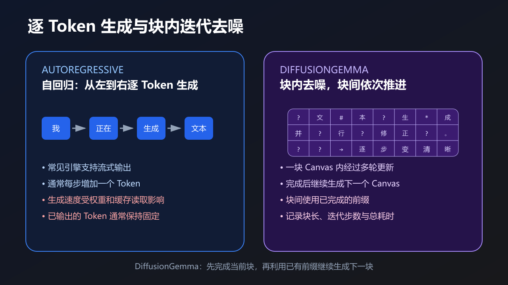

# 27B 模型技术分享：补充阅读

基础术语已放回[分享正文](27B模型如何塞进20GB显存-技术分享.md)，在第一次使用时解释。这里保留模型内部结构、其他评估指标和 DiffusionGemma，供问答时展开。

## 1. 层数相同，参数量为什么不同

层数表示模型有多少组依次执行的计算模块。每层有多宽、使用什么计算结构，也会影响参数量。因此，两个模型都有 64 层，文件大小和计算量仍可能不同。

| 名称 | 含义 |
|---|---|
| Hidden Size | Token 在层间传递的数值向量长度；可以理解为每个 Token 用多少个数表示 |
| FFN（Feed-Forward Network，前馈网络） | 按 Token 分别处理数值向量的一组计算；在常见结构中先扩展维度，再压回去 |
| Intermediate Size | FFN 中间向量的长度，会影响这一部分的参数量和计算量 |
| 词表（Vocabulary） | 分词器能够使用的 Token 集合；词表大小也会影响嵌入层和输出层的规模 |

Qwen3.8-27B 的语言部分有 64 个 block，Hidden Size 为 5,120，Intermediate Size 为 17,408。视觉编码器的层数与语言部分分开统计。[官方配置](https://huggingface.co/Qwen/Qwen3.8-27B/blob/main/config.json)。

这些数字可以帮助估算模型规模，但不能单独预测速度。实际耗时还受注意力结构、量化格式和计算后端影响。

## 2. MoE 的总参数与激活参数

正文介绍过，MoE 会为当前 Token 选择部分专家参与计算。**总参数量**包括所有专家和共享部分的参数；**激活参数量**表示处理一个 Token 时参与计算的参数规模。

每步只使用部分专家，可以减少该步骤的计算量，但通常仍要保存全部专家权重。跨模型比较时，要同时考虑存储、专家选择、数据传输和后端实现，不能只看其中一个参数量。

两个不同模型的结构、训练和分词器往往也不同。它们的测试结果可以用来选模型，却不能直接说明某种量化方式或某一种结构带来了多少提升。

## 3. 任务正确率之外的评估指标

正文使用有标准答案的任务，检查内容、格式和请求完成情况。研究量化误差时，还可以使用下面两个指标。

| 指标 | 衡量什么 | 使用时注意什么 |
|---|---|---|
| Perplexity（困惑度） | 模型对一段测试文本的预测有多不确定；同一评估条件下，通常越低越好 | 需要固定数据、分词器和计分方式，不能随意比较不同测试得到的数值 |
| KL 散度 | 量化模型与参考模型的输出概率分布有多大差异 | 需要取得两者的概率分布；分布更接近，也不保证每道题的最终答案相同 |

当前脚本没有计算这两个指标。对于部署选择，仍应优先检查自己的任务能否完成，以及完成所需的时间和资源。

## 4. 自回归与 DiffusionGemma

### 4.1 两种生成过程

普通**自回归生成**会根据已有输入和输出预测下一个 Token，再把它接到序列末尾，继续生成。

DiffusionGemma 使用一块称为 **canvas（画布）**的 Token 区域。其中一部分位置最初是掩码，即尚未确定的占位符。模型经过多轮计算，逐步确定这些位置的内容，这个过程称为**去噪**。

这里的去噪发生在一块 canvas 内。完成一块后，模型继续生成下一块，并利用已经完成的前缀。因此，DiffusionGemma 是**块内迭代去噪、块间自回归**。[官方模型卡](https://ai.google.dev/gemma/docs/diffusiongemma/model_card)。

| 比较项 | 普通自回归 | DiffusionGemma |
|---|---|---|
| 怎样推进输出 | 通常每步增加一个 Token | 当前 canvas 经多轮更新后，再推进到下一块 |
| 怎样使用已有输出 | 每一步使用已生成的前缀 | 下一块使用已完成的前缀 |
| 客户端观察到的输出 | 通常持续收到小块内容 | 可能有不同的块级等待和输出节奏 |
| 额外记录什么 | 输入、输出长度和生成设置 | 还要记录 canvas 长度、迭代步数及流式输出方式 |

### 4.2 怎样比较性能

两种方式都应测任务正确率和完整答案时间。比较 tok/s 时，要确认 Token 的统计范围和计时区间相同；生成方式不同，客户端看到的流式节奏也可能不同。

如果另做本机演示，记录后端版本、canvas 长度、迭代步数、显存和任务结果。GGUF 文件能放进预算，只能用于启动前的初步筛选，实际运行占用仍需测量。

这项实验与 Qwen 的权重量化对比分开记录，便于说明每组结果到底比较了什么。
