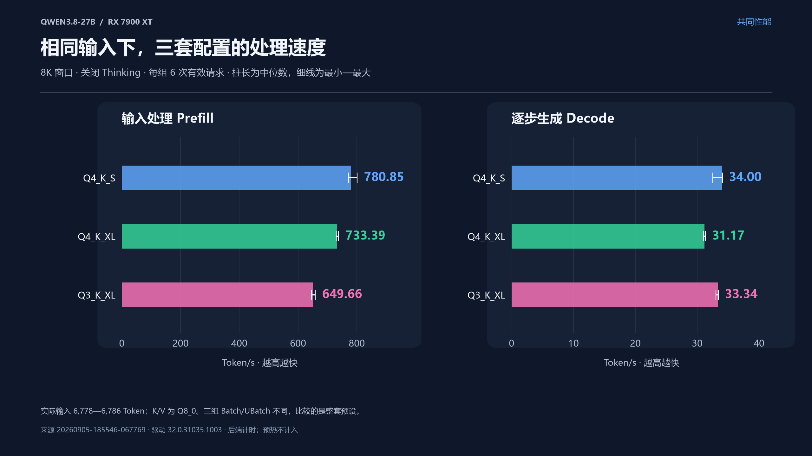

# 本地部署qwen3.8-27B

第一期 · 2026-09-06

记录 Qwen3.8-27B 在 20 GB 显存机器上的部署方法，以及三种量化版本的性能、上下文和质量测试。

## 阅读入口

| 内容 | 文件 |
| --- | --- |
| 技术分享正文 | [27B 模型如何塞进 20 GB 显存](27B模型如何塞进20GB显存-技术分享.md) |
| 完整实测报告 | [Qwen3.8-27B 本机实测报告](Qwen3.8-27B本机实测报告.md) |
| 测试方案 | [上下文与性能测试方案](Qwen3.8-27B上下文与性能测试方案.md) |
| 图表与绘图数据 | [实测图表](local-llm-sharing-assets/benchmarks/README.md) |
| 测试脚本与运行说明 | [context-benchmark](context-benchmark/README.md) |
| 原始测试记录 | [全部运行结果](context-benchmark/runs/) |
| 补充阅读 | [27B 模型技术分享：补充阅读](27B模型技术分享-补充阅读.md) |
| 审阅与修正记录 | [审阅意见](审阅意见-27B技术分享与测试.md) · [修正说明](修正说明-20260905.md) |

## 数据来源

当前正文和图表使用两轮测试：

- [20260905-185546-067769](context-benchmark/runs/20260905-185546-067769/)：共同性能和上下文容量测试，关闭 Thinking。
- [20260905-230353-216459](context-benchmark/runs/20260905-230353-216459/)：质量测试，三种量化版本均开启 Thinking，思考强度为 xhigh。

`runs/` 同时保留调试、试运行和历史记录。各轮的配置、源码快照、日志及逐次请求结果均在对应目录中；阅读本期结论时，以正文和报告标注的数据来源为准。

## 使用资料

文档保留 Markdown 格式，图片使用相对路径。下载仓库后，保留本目录结构即可阅读和运行脚本；测试前，按运行说明修改 `benchmark_config.json` 中的模型路径。

本目录包含原始资料和测试结果，未包含模型权重。Python 字节码与 Matplotlib 字体缓存未上传。历史记录中的本机路径及备份引用按原样保留。

[返回期次目录](../README.md) · [返回网站](https://www.acgnx.top/writing/)
